# Architecture

## Trust boundaries
Untrusted: the network, the device clock, event bytes as they arrive, anything not yet committed. Trusted by registration: a device whose token subject matches an **active** registered device. Trusted: the service after validation, the committed event log, the audit chain. **Nothing is a record until it has passed verification and been committed in the same transaction as its outbox row and audit entry.**

## Per-event lifecycle (device view and server view)

```mermaid
stateDiagram-v2
    [*] --> local: append (encrypted, durable, numbered, hashed)
    local --> uploading: batch selected (cursor read first)
    uploading --> local: link failed / 5xx / timeout (retry with backoff)
    uploading --> acked: server commit + ack through N
    uploading --> failed: 422 (hash or schema failure)
    failed --> local: reviewer authorised a retry
    acked --> [*]: compaction (only after ack; sequence numbers never reused)
```

Server side, one event: `received -> validated -> committed(events+outbox+cursor+audit) -> projected(records|conflict)`; a failure at *validated* becomes `quarantined(preserved as received) -> reviewer: retry_authorized | skip_authorized`.

## Sequence
```mermaid
sequenceDiagram
    participant D as Device
    participant A as API
    participant DB as Store (one tx)
    participant O as Outbox consumer
    participant L as Audit log
    D->>A: GET cursor
    A-->>D: acked_seq = N
    D->>A: POST batch (N+1..M) + Idempotency-Key
    A->>A: auth, own-device, schema, hash, continuity
    alt all events valid
        A->>DB: events + outbox + cursor + batch result + audit
        A-->>D: 200 ack_through M
        O->>DB: project idempotently (records, versions, notes)
        O-->>DB: stale edit -> conflict (nothing overwritten)
    else an event fails
        A->>DB: commit valid prefix; quarantine bad event as received; block device
        A->>L: sync.quarantined + alert
        A-->>D: 422 (ack_through = last good)
    end
```

## Key decisions
1. **Numbers prove order and completeness; hashes prove content.** The cursor advances only to `acked+1`; a gap gets `409` with the expected number.
2. **Idempotency is layered.** (a) Idempotency key returns the stored result; reuse with different content is refused. (b) Events at or below the cursor are counted as duplicates. (c) An already-acknowledged number with different content is quarantined as critical.
3. **Acknowledge only after commit; compact only after acknowledge.** The device never deletes what the server has not confirmed. The sequence counter is stored separately from rows so compaction cannot rewind it (a real bug the tests found).
4. **The device reads the cursor before sending.** A lost acknowledgement is therefore recovered without a resend; if it does resend, the same key replays the stored result.
5. **Append-only facts never conflict; mutable edits are versioned.** A stale `base_version`, a duplicate create, or a note for a missing record opens a conflict for a person; the record is not changed.
6. **Projections are outbox-driven and idempotent**, so a crash between commit and projection heals at start-up.
7. **Deterministic decisions, advisory AI.** Quarantine, blocking, conflicts and alerts are rules. The optional advisory (`triage.py`) can add detail, never subtract, never runs inside a transaction and is off unless configured. See `docs/SRS.md` FR-AI.
8. **Device clock is untrusted.** Ordering uses sequence numbers; both device time and server receipt time are stored.
9. **Separation of duties is structural:** admin cannot read events or records; auditor cannot decide; reviewer cannot see the fleet; registrar cannot activate their own device.
10. **The audit log is a hash chain with signed checkpoints**; `/readyz` fails if it does not verify.

## Scale-out mapping (production)
Gateway with mTLS/OIDC to API pods, PostgreSQL primary with `REVOKE UPDATE, DELETE` on event and audit tables, logical replication to an independent audit sink, object storage with Object Lock for exported archives and audit checkpoints (`deploy/terraform`), a scheduled scan/checkpoint/verify job (`deploy/k8s`), and device authentication by mTLS or attested keys instead of bearer tokens. Batch size and payload limits come from measured load, not the defaults here.

## Known limits
* SQLite store is single-writer (`replicas: 1`); move to PostgreSQL for HA.
* Triggers make alteration **tamper-evident**, not tamper-proof; a database owner can drop them (tested). Production needs WORM storage and separate roles.
* Dev bearer tokens; production must terminate OIDC/mTLS and map claims to `Principal`.
* Signing keys are environment-provided; production keys belong in KMS/HSM with rotation (`key_id` is recorded).
* Events are hash-protected, not individually signed by the device.
* TLS and server-side encryption at rest are deployment work (not built).
* Checkpoint upload and event export to the WORM buckets are not automated.
* No rate limiting or WAF in the service; expected at the gateway.
