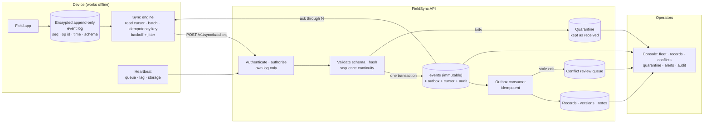
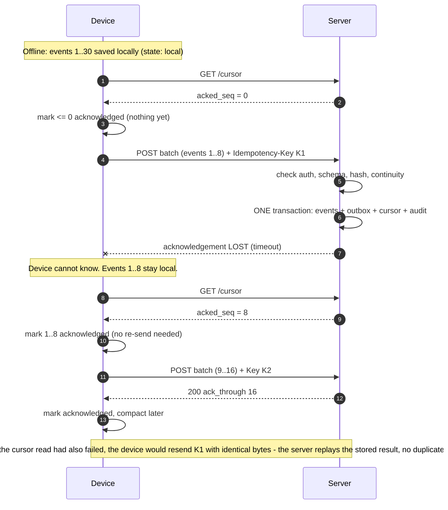
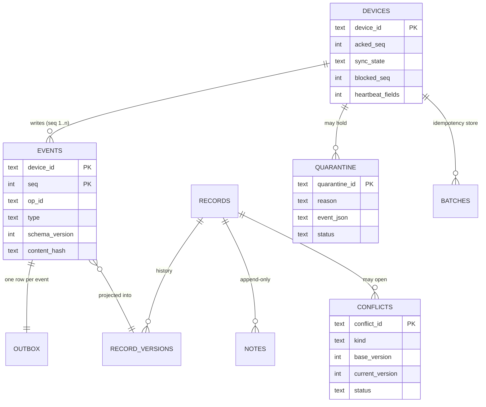

# FieldSync: Solution Deep Dive

*An offline-first device sync system, explained from first principles, with the operator console drawn screen by screen. Written for someone who has never built sync before.*

> **Reading guide.** §1 to §6 explain the problem and the design. §7 walks the design's failure modes. §8 is the **screen atlas**: a wireframe for every screen and state, each with its purpose, its place in the workflow and what the person can do. §9 onward covers quality, shipping, running and limits.
> **Honesty note.** Wireframes are drawn from the code as built. Nothing here was rendered in a real browser while writing; `SRS-Compliance.md` lists what was and was not verified.

## Contents
1. [The problem in plain words](#1-the-problem-in-plain-words) · 2. [The design in one page](#2-the-design-in-one-page) · 3. [The sync protocol](#3-the-sync-protocol) · 4. [Guarantees and how each is enforced](#4-guarantees-and-how-each-is-enforced) · 5. [Data model](#5-data-model) · 6. [Roles and separation of duties](#6-roles-and-separation-of-duties) · 7. [What goes wrong, and what happens](#7-what-goes-wrong-and-what-happens) · 8. [Screen atlas](#8-screen-atlas) · 9. [Folder tour](#9-folder-tour) · 10. [Design system](#10-design-system) · 11. [Quality](#11-quality) · 12. [Shipping](#12-shipping) · 13. [Running it](#13-running-it) · 14. [Limits and next steps](#14-limits-and-next-steps) · 15. [FAQ and glossary](#15-faq-and-glossary)

---

## 1. The problem in plain words

An officer's device is in a vehicle in a tunnel, in a rural dead zone, or in a building with bad signal. The officer still has to write a report, add a note, correct a title. If the app says "no connection, try later", people write on paper and the record becomes untrustworthy.

So the device must **keep working offline**. But when the signal returns, the server must end up with **exactly what the device recorded**: nothing lost, nothing twice, nothing reordered, nothing silently overwritten, and every step visible to a supervisor and provable to an auditor.

Four words carry the whole design:

| Word | Meaning here | Everyday picture |
|---|---|---|
| **Durable** | Saved to disk before the screen says "saved"; the server confirms only after it is committed | A receipt stamped only after the money is in the till |
| **Ordered** | Each device numbers its events 1, 2, 3…; the server accepts only the next number | Page numbers in a bound logbook |
| **Idempotent** | Sending the same thing twice has the same effect as once | Pressing an elevator button twice |
| **Visible** | Every entry shows where it is; every device shows how far behind it is | Parcel tracking |

## 2. The design in one page



The same ideas exist twice on purpose: a **browser** implementation (`web/src/lib/sync`, used by the Field app) and a **Python** implementation (`src/fieldsync/device.py`, used by tests and the demo). Both hash events identically; a shared test vector proves it.

## 3. The sync protocol



Rules the server applies, in order, to every batch:

1. **Who?** Token valid; the token's subject *is* the device ID; device active in this agency.
2. **Same request before?** Same key + same content → return the stored answer. Same key + different content → refuse.
3. **Blocked?** A device waiting on a quarantine review cannot advance.
4. **For each event:** already acknowledged? → count as duplicate (if content differs → quarantine, critical). Next expected number? else → *gap* (409, tells the device where to resume). Hash recomputes? Schema valid? else → quarantine.
5. **Commit** events, outbox rows, cursor and one audit entry in a single transaction.
6. **Acknowledge** through the last committed number. Only now may the device forget those events.

## 4. Guarantees and how each is enforced

| Guarantee | Mechanism | Proven by |
|---|---|---|
| Works offline, durable | Encrypted local log written (IndexedDB / SQLite `synchronous=FULL`) *before* the UI confirms | restart test, journey test |
| Ordered | Per-device sequence; server accepts only `acked+1` | gap and non-contiguous tests |
| Never reused | Counter kept separately from rows (`sqlite_sequence`, IndexedDB meta) so compaction cannot rewind it | compaction tests (found a real bug in the first draft) |
| Idempotent | Idempotency key + stored result; duplicates at or below the cursor are counted, not stored | replay, duplicate, lost-ack tests |
| Tamper-evident content | SHA-256 over canonical JSON of the envelope + device ID, recomputed server-side | cross-language vector, mismatch test |
| Never silently overwritten | Edits carry `base_version`; stale base → conflict, not update | conflict tests |
| Originals immutable | Triggers forbid UPDATE/DELETE on events, versions, notes, skips, audit; quarantined bytes cannot change | immutability tests |
| Auditable | Hash-chained log, signed checkpoints, `/readyz` fails if the chain breaks | tamper test |
| Visible | Per-entry states, heartbeat, fleet connectivity, metrics, alerts | fleet, metrics, journey tests |

### The two follow-up questions

**"How do you prevent an administrator altering evidence?"** Structurally, not by trust. The `admin` role can enrol devices and sign checkpoints but has *no* permission to read events or records, and cannot change them (there is no such endpoint). Auditors read but cannot decide. Enrolment needs two different administrators. Every attempt, including denials, lands in a hash-chained log that anyone with the signed checkpoints can verify. Honest limit: in this reference a *database owner* can drop the triggers (the test does exactly that) but the chain then fails verification and `/readyz` turns red. Making alteration *impossible* rather than *detectable* needs WORM/object-lock storage and separate database roles, described but not built.

**"What happens if the hash does not match?"** The event is **quarantined**: stored byte-for-byte as received in an append-only table, never applied to records, never shown as verified. Events before it in the same batch stay committed. The device is **blocked** (cursor cannot advance) so ordering is never faked. An alert is raised and the fact is audited. A reviewer opens the quarantine screen, sees the event as received and a hash recomputed in their own browser, and chooses **retry** (device resends the original) or **skip** (sequence retained, never applied). Either way the decision, reviewer and note join the audit log.

## 5. Data model



Event types in this reference: `report.create`, `report.update` (needs `base_version`), `note.add` (append-only, never conflicts). Schema v1 has `title`/`body`; v2 adds optional `severity`. Unknown versions or types are quarantined as `schema_rejected`.

## 6. Roles and separation of duties

| Role | Can | Cannot |
|---|---|---|
| **device** | write its own log, read its own cursor, heartbeat | read anything else |
| **supervisor** | fleet, events, records, alerts (ack), conflicts and quarantine (read), fleet scan | decide conflicts or quarantines |
| **reviewer** | records, events, decide conflicts and quarantine | see the fleet, alerts, audit |
| **auditor** | audit log and verify, fleet, events, alerts, conflicts, quarantine (read) | change any state except acknowledging alerts |
| **admin** | enrol/activate/revoke devices, sign checkpoints | read events or records |

The console hides what a role cannot use, but the API is the authority: a hand-edited menu still gets `403`, and that refusal is itself logged.

## 7. What goes wrong, and what happens

| Situation | Behaviour |
|---|---|
| No connectivity for hours | Entries pile up locally as **Local only**; nothing blocks the operator |
| Request never reaches the server | Device keeps events, retries with exponential backoff and jitter |
| Server commits, acknowledgement is lost | Device reads the cursor next pass and sees the events are already there; if it resends anyway, the same key replays the stored result |
| Same events sent twice | Counted as duplicates, stored once |
| A batch arrives with a missing number | `409 sequence_gap` with the expected number; device resumes from the cursor |
| Event altered in transit or corrupted on disk | Quarantine, block, alert, review (see §4) |
| Unknown schema version (a newer app on an old server) | `schema_rejected` quarantine; nothing applied |
| Two units edit the same record from the same base | Second edit becomes a **conflict**; the record is not changed; a reviewer decides |
| Note refers to a record that does not exist yet | Conflict `missing_record`; nothing lost |
| Server crashes between commit and projection | Outbox row stays pending; start-up drains it; projections are idempotent |
| Device silent for an hour | Fleet shows **offline**; fleet scan raises an alert (once) |
| Disk almost full / huge backlog | Heartbeat shows it; alerts `STORAGE_LOW` / `BACKLOG_HIGH` |
| Someone edits the audit log directly | Chain verification fails; `/readyz` is 503; a red banner appears on every screen |
| A device is stolen | Admin revokes it; all further writes are refused |

---

## 8. Screen atlas

Each artboard: **frame and layout** (what a designer would set in Figma), a **wireframe**, then **purpose**, **role in the workflow**, **what you can do**, **states**, **API** and **who**. Legend: `[ Button ]` action · `[x]` primary · `( ... )` input · `{ badge }` status chip · `▓░` bar.

| # | Artboard | Route | # | Artboard | Route |
|---|---|---|---|---|---|
| S01 | Sign-in | `/login` | S12 | Conflict decision dialog | overlay |
| S02 | App shell | all | S13 | Quarantine queue | `/quarantine` |
| S03 | Command palette | overlay | S14 | Quarantine review dialog | overlay |
| S04 | Dashboard | `/` | S15 | Alerts | `/alerts` |
| S05 | Field app: online, synced | `/field` | S16 | Alert dialog | overlay |
| S06 | Field app: offline, queued | `/field` | S17 | Audit log | `/audit` |
| S07 | Field app: blocked or failed | `/field` | S18 | Audit entry dialog | overlay |
| S08 | Fleet | `/fleet` | S19 | Device enrolment | `/devices` |
| S09 | Device detail (overview, event log) | `/fleet/:id` | S20 | Settings | `/settings` |
| S10 | Records | `/records` | S21 | System states | everywhere |
| S11 | Record detail | `/records/:id` | | Conflicts queue | `/conflicts` (S11b) |

### S01 · Sign-in
**Frame** 1440×900, fluid to 360. **Layout** one centred column, max 512, gap 16.
```text
+--------------------------------------------------------------------------+
|              [#]  FieldSync Console                                      |
|                   Operate a fleet of offline-capable devices ...         |
|              +--------------------------------------------------+        |
|              | (key) Access token                               |        |
|              | +----------------------------------------------+ |        |
|              | | Paste the token issued for you ...           | |        |
|              | +----------------------------------------------+ |        |
|              | Held in this tab only. Discarded on close/sign-out|        |
|              | +----------------------------------------------+ |        |
|              | | {device} unit-0417 @ agency-1   expires 10:42| |        |  <- decoded preview
|              | | Can: sync:write, sync:cursor, sync:heartbeat | |        |
|              | +----------------------------------------------+ |        |
|              | Your session expired. Sign in with a fresh token.|        |  <- notice
|              | [x]                 Sign in                  [x] |        |
|              +--------------------------------------------------+        |
|              (shield) Service online, audit chain intact                  |
+--------------------------------------------------------------------------+
```
**Purpose** The only door in; turns a long string into "a known identity with known powers" before any request. **Role** Start and restart of every session (sign-out, expiry and 401 land here with the reason). **You can** paste a token, see who it says you are and what you may do, learn whether the service is up and its audit chain intact before signing in. **States** empty · typing (preview) · rejected (malformed / expired) · notice · service down. **API** `GET /readyz`. **Who** anyone.

### S02 · App shell
**Frame** 1440×900 / 390×844. **Layout** sidebar 240 fixed | main fluid; top bar 56; content max 1152.
```text
+---------------------+----------------------------------------------------------------+
| [#] FieldSync Console| ( Search or run...       Ctrl K ) {audit chain intact}         |
|     OFFLINE-FIRST   |        {supervisor} sup-1  14:32  (sun)  (exit)                |
|---------------------+----------------------------------------------------------------+
| > Dashboard         | ! You are offline. Data may be stale.            <- when offline |
|   Field app*        |                                                                |
|   Fleet             |                        PAGE CONTENT                            |
|   Records           |                                                                |
|   Conflicts         |    (*Field app only for role device; menu is filtered by role) |
|   Quarantine        |                                                                |
|   Alerts            |                                                                |
|   Audit log         |                                                                |
|   Enrolment         |                                                                |
|   Settings          |                                                                |
+---------------------+----------------------------------------------------------------+
PHONE: title + [find] {pill} (o) | horizontal tab strip of the same items | content
```
**Purpose** Constant orientation: where am I, is the system safe, how long is my session. **You can** navigate · open the palette (Ctrl/Cmd+K) · read the integrity pill (`checking` / `audit chain intact` / `AUDIT INTEGRITY FAILURE` / `API unreachable`, every 15 s) · watch the session countdown (amber under 2 min, warned once, sign-out at zero) · toggle theme · sign out · use the Skip-to-content link. **States** offline banner · integrity failure · no identity (renders nothing while redirecting). **API** `GET /readyz`. **Who** everyone signed in.

### S03 · Command palette
```text
+--------------------------------------------------+
| Command palette                              (x) |
| ( Type a command...                            ) |
| | Go to Dashboard                              |  |
| |>Go to Fleet                                  |  |   <- highlighted
| | Go to Conflicts                              |  |
+--------------------------------------------------+
```
**Purpose** Keyboard-first navigation. **You can** filter, ↑/↓, Enter, Esc; only destinations your role may open are listed. **A11y** combobox + listbox, `aria-activedescendant`, focus trap. **API** none.

### S04 · Dashboard
**Layout** header · KPI grid (4 × 2) · two-column row (2/3 + 1/3).
```text
Sync operations                        [Verify audit chain] [Sign audit checkpoint]
agency-1 · signed in as sup-1 (supervisor)
+ ! Audit integrity failure. hash mismatch at seq 812 ... (red, only if broken)   +
+--------------+ +--------------+ +--------------+ +--------------+
| (radio)      | | (wifi-off)   | | (timer)      | | (!)          |
| Devices online| Offline too long| Longest sync lag| Open alerts   |
|   412 / 430  | |     3        | |    4m        | |     5        |
+--------------+ +--------------+ +--------------+ +--------------+
| In quarantine| | Conflicts to | | Blocked      | | Events stored|
|     1        | | review  2    | | devices  1   | |   1,204,331  |
+--------------+ +--------------+ +--------------+ +--------------+
+-----------------------------------------------+ +----------------------------+
| Furthest behind                    [Open fleet]| | Pipeline health            |
| unit-0417 {offline} backlog 88 · lag 3800s    | | Audit entries        9,881 |
| unit-0102 {delayed} backlog 12 · lag 410s     | | Outbox pending           0 |
+-----------------------------------------------+ | Largest device backlog  88 |
                                                  | Lowest storage free    7%  |
                                                  +----------------------------+
```
**Purpose** "Is the fleet healthy right now?" in five seconds. **Role** Landing page; every red tile links to the screen that fixes it. **You can** read eight tiles, jump to Fleet/Alerts/Quarantine/Conflicts by clicking a tile, see the five devices furthest behind, verify the chain (auditor) or sign a checkpoint (admin). Refresh every 15 s. **States** loading skeletons · not available to your role · empty · error with **Try again** and request ID · integrity banner. **API** `GET /readyz`, `/metrics`, `/v1/fleet`, `POST /v1/audit/verify`, `/checkpoint`. **Who** everyone; fleet list needs `fleet:read`.

### S05 · Field app, online and synced
**Frame** 1440×900. **Layout** header · status strip · four counters · two columns (form 2/5, log 3/5). Only for role `device`.
```text
Field app                                   [Simulate offline] [Sync now]
unit-0417 · works without a connection; everything is saved here first ...
+--------------------------------------------------------------------------------+
| (wifi) Online   Synchronised 3 event(s)      (db) Encrypted, durable local store |  green strip
+--------------------------------------------------------------------------------+
+-----------+ +-----------+ +---------------+ +--------+
| Local only| | Uploading | | Acknowledged  | | Failed |
|     0     | |     0     | |      27       | |   0    |
+-----------+ +-----------+ +---------------+ +--------+
+---------------------------------+ +--------------------------------------------+
| New entry                       | | Event log            [Clear old acknowledged]|
| What are you recording?         | | #27 report.create {Acknowledged}   10:41    |
| ( New report                  v)| |     rpt-3f9a... (hash chip)                  |
| Title ( Traffic stop          ) | | #26 note.add      {Acknowledged}   10:39    |
| Details                         | | ...                                          |
| ( Vehicle 12, no injuries     ) |                                                |
| [ Save on this device ]         |                                                |
| (shield) Each entry is numbered,|                                                |
| hashed, and written to encrypted|                                                |
| storage before this confirms it.|                                                |
+---------------------------------+ +--------------------------------------------+
```
**Purpose** The operator's tool. It is the *whole point* of offline-first: it never waits for the network. **Role** Origin of every event in the system. **You can** create a report, add a note to a report, change a title (each numbered, hashed and stored durably first) · see per-entry state · press **Sync now** · toggle **Simulate offline** to rehearse or demonstrate · clear old acknowledged entries (keeps the newest 200). Automatic sync runs every few seconds when online. **A11y** the strip is `role="status"` (screen readers hear "Offline"/"Online"); the log is a labelled list. **API** `GET /cursor`, `POST /v1/sync/batches`, `POST /heartbeat` (every 30 s). **Who** role `device`; others see an explanation (S21).

### S06 · Field app, offline and queued
```text
+--------------------------------------------------------------------------------+
| (cloud-off) Offline  Cannot reach the service. Your work is safe on this device; |
|             retrying with backoff.            (db) Encrypted, durable local store |  amber strip
+--------------------------------------------------------------------------------+
| Local only: 4 | Uploading: 0 | Acknowledged: 27 | Failed: 0 |
| Event log                                                                      |
| #31 note.add       {Local only}                                     11:02      |
| #30 report.update  {Local only}  2 attempts                         11:01      |
| #29 report.create  {Local only}                                     11:00      |
```
**Purpose** Show that being offline is a normal, calm state, not an error. **You can** keep recording; watch entries wait; see attempt counts grow as backoff retries; see them flip to **Acknowledged** on their own when the link returns, in order. **States** offline (real or simulated) → back online → syncing → synchronised. **Guarantee** nothing is removed from the device until the server confirms it.

### S07 · Field app, blocked or failed
```text
| (wifi) Online   An event was rejected (hash mismatch). It is kept locally.       |  red-tinted text
| Local only: 2 | Uploading: 0 | Acknowledged: 27 | Failed: 1 |
| #29 note.add       {Failed}  hash mismatch                                     |
| #30 note.add       {Local only}                                                 |
| ...   or:  "Sync is paused: a reviewer must clear a quarantined event."         |
```
**Purpose** Make a serious situation legible without alarm or jargon. **Role** The device-side face of quarantine: the operator can keep working; the queue simply waits for a reviewer. **You can** keep recording; see which entry failed and why; nothing is lost. **API** same as S05 (the server returns 422/409). **Who** device.

### S08 · Fleet
**Layout** header with Scan + Refresh · table (sortable, filter, paging).
```text
Fleet                                                     [Scan fleet] [Refresh]
( Filter devices...                  ) 430 rows
DEVICE            LINK      SYNC              ACKED#  BACKLOG  LAG   STORAGE FREE  LAST SEEN
unit-0417         {offline} {blocked at #29}   28     88       3800s ▓░░░░ 7%      1h ago
Patrol 417
unit-0102         {delayed} {ok}              1204    12       410s  ▓▓▓▓▓ 61%     6m ago
unit-0009         {online}  {ok}              9021    0        0s    ▓▓▓▓░ 44%     12s ago
                                                    < Page 1 / 29 >
```
**Purpose** "Which devices need attention?" **Role** The supervisor's home base and the entry to device detail. **You can** sort by any column (worst first), filter by text, open a device, scan the fleet (raises offline/backlog/storage alerts once each). Refreshes every 15 s. **States** loading · empty ("No devices registered yet") · error. **API** `GET /v1/fleet`, `POST /v1/fleet/scan`. **Who** `fleet:read`; scan needs `fleet:scan`.

### S09 · Device detail
```text
Patrol unit 417                                                [ Review quarantine ]  <- if blocked
unit-0417
[ Overview ] [ Event log ]
+--------------------------------------------------------------------------------+
| Link {offline}                     Last seen 1h ago (Sep 30, 09:58)            |
| Acknowledged through #28           Sync state blocked at #29: awaiting review  |
| Reported backlog 88                Oldest unsynced event 3800s                 |
| Storage 70 MB free of 1 GB         App version / retries 1.0.0 / 14            |
| Agency agency-1                    Registration active                         |
+--------------------------------------------------------------------------------+
EVENT LOG TAB: table  # | type | record (link) | device time | received | hash (copy)
```
**Purpose** Everything about one device. **Role** Diagnosis ("why is this one behind?") and proof ("here is exactly what it sent, in order"). **You can** read health facts · jump to quarantine when blocked · read the immutable event log with hashes (roles with `events:read`; each read is audited) · follow a record link. **API** `GET /v1/devices/{id}`, `/events`. **Who** `fleet:read`; log needs `events:read`.

### S10 · Records
```text
Records
Current state built from acknowledged events. Every version keeps its origin device and sequence number.
( Filter records... )
RECORD            TITLE             VERSION  CREATED BY DEVICE   UPDATED
rpt-3f9a1c...     Traffic stop      {v2}     unit-0417           2m ago
```
**Purpose** The business result of syncing. **Role** What supervisors actually read. **You can** filter, sort, open a record. **API** `GET /v1/records`. **Who** `records:read`.

### S11 · Record detail
```text
Traffic stop                              rpt-3f9a1c... · version 2
+ This record has an open conflict awaiting review. [Review conflicts] +       <- if any
+-------------------------------+ +-----------------------------------------+
| Current content               | | Version history (append-only)           |
| title: Traffic stop           | | v1 {create}  Sep 30 10:01 · unit-0417 #1|
| body:  Vehicle 12, no injuries| | v2 {update}  Sep 30 10:05 · unit-0417 #2|
+-------------------------------+ +-----------------------------------------+
| Notes (2)                                                                     |
| Arrived 10:03 · unit-0417 #3 · Sep 30 10:03                                   |
```
**Purpose** Show a record's whole life: who changed what, when, from which device and sequence number. **Role** The audit-friendly view; a reviewer checks it before deciding a conflict. **You can** read content, versions (including reviewer decisions), notes, and jump to open conflicts. **API** `GET /v1/records/{id}`. **Who** `records:read`.

### S11b · Conflicts queue and S12 · decision dialog
```text
Conflicts                                          [ Open ] [ Resolved ]
KIND                                    RECORD         FROM            BASED ON / NOW  OPENED
{Edited from an out-of-date version}    rpt-3f9a..     unit-0102 #1    v1 / v2         2m ago

+---------------------------------------------------------------------------+
| Edited from an out-of-date version                                    (x) |
| rpt-3f9a1c... · opened Sep 30, 10:07                                      |
| +-----------------------------+ +---------------------------------------+ |
| | Current on the server (v2)  | | Proposed by unit-0102 #1 (from v1)    | |
| | title: Traffic stop         | | title: Vehicle stop, Route 9          | |  <- amber border
| +-----------------------------+ +---------------------------------------+ |
| Decision ( Keep the current version (dismiss the proposal)          v)    |
|          ( Apply the proposed change as a new version                )    |
| Reason (min 8 characters) ( Unit B has the corrected title           )    |
| [ Record decision ]  ->  [ Confirm and record ]                           |
+---------------------------------------------------------------------------+
```
**Purpose** Let a person settle divergent edits **with both sides in view**. **Role** The escape valve that lets append-only sync tolerate mutable data safely: nothing is merged silently. **You can** compare current vs proposed · keep current or apply proposed as a **new version** (history keeps both) · must write a reason · confirm with a second click. *Apply* is offered only for out-of-date edits; duplicate creates and orphan notes can only be dismissed. **API** `GET /v1/conflicts`, `POST /v1/conflicts/{id}/resolve`. **Who** `conflicts:read`; deciding needs `conflicts:review`.

### S13 · Quarantine queue and S14 · review dialog
```text
Quarantine                       [ Awaiting review ] [ Retry authorised ] [ Skipped ]
REASON           DEVICE / SEQ        EVENT         RECEIVED   STATUS
{hash mismatch}  unit-0417 #29       note.add      3m ago     {open}

+---------------------------------------------------------------------------+
| unit-0417 #29                                                         (x) |
| The content hash does not match the event bytes: altered in transit ...   |
| Claimed hash   3c1f...a09b (copy)                                         |
| Computed here  91aa...77d2 (copy)  {differs}                              |
| The event exactly as received (immutable)                                 |
| { "seq": 29, "type": "note.add", "payload": {"text": "altered ..."} ... } |
| Decision ( Authorise a retry (the device resends the original)       v)   |
|          ( Skip this sequence number (retained, never applied)       )   |
| Reason (min 8 characters) ( Transit corruption; resend authorised    )    |
| [ Record decision ] -> [ Confirm and record ]                             |
| The received bytes stay preserved either way.                             |
+---------------------------------------------------------------------------+
```
**Purpose** The human step for an event the machine refused. **Role** The answer to "what if the hash does not match?": preserve, block, alert, review, audit. **You can** read why it failed · for hash mismatches **see the hash recomputed in your own browser** next to the claimed one · read the event exactly as received · authorise a retry or skip the sequence (only the next unacknowledged number can be skipped) · must give a reason and confirm. The device is released immediately. **API** `GET /v1/quarantine`, `POST /v1/quarantine/{id}/disposition`. **Who** `quarantine:read`; deciding needs `quarantine:review`.

### S15 · Alerts and S16 · alert dialog
```text
Alerts                                            [ Scan fleet ] [ Refresh ]
[ Open ] [ Acknowledged ]
SEVERITY  KIND               WHAT IT MEANS                          OBJECT      RAISED
{high}    EVENT_QUARANTINED  An event failed integrity or schema... qt_8a1f..   2m ago
{medium}  DEVICE_OFFLINE     A device has not contacted the service  unit-0417   1h ago

+--------------------------------------------------+
| EVENT_QUARANTINED                            (x) |
| Raised Sep 30, 10:03:11        {high}            |
| An event failed integrity or schema checks ...   |
| { "device_id": "unit-0417", "seq": 29, ... }     |
| Object qt_8a1f... (copy)  open quarantine        |
| [ Acknowledge alert ]  ->  [ Confirm acknowledge]|
+--------------------------------------------------+
```
**Purpose** A worklist. **Role** Bridges detection to action: each alert names the object and links to the screen that resolves it. Quarantine and conflict alerts close themselves when the reviewer decides. **You can** switch Open/Acknowledged, sort (critical first), filter, open a row, acknowledge with two clicks, scan the fleet. Refresh every 30 s. **API** `GET /v1/alerts`, `POST /v1/alerts/{id}/ack`, `POST /v1/fleet/scan`. **Who** `alerts:read`; ack needs `alerts:ack`.

### S17 · Audit log and S18 · entry dialog
```text
Audit log                                                          [ Verify chain ]
( Filter by actor, action, object... ) [ Load older->newer (200) ] [ >> Load all ]
#    WHEN            ACTOR               ACTION              OBJECT       FROM
812  Sep 30 10:40    unit-0417 {device}  sync.batch          unit-0417    10.0.0.4
811  Sep 30 10:39    system {system}     sync.quarantined    qt_8a1f..    -
799  Sep 30 10:31    rdr-4 {reviewer}    authz.denied        fleet:read   10.0.0.7   <- red text

+--------------------------------------------------+
| Entry #811   sync.quarantined                (x) |
| Actor system · Object quarantine qt_8a1f...      |
| Request ID 4c17...  Source -                     |
| Previous hash 3c1f... (copy)  Entry hash 91aa... |
| { "device_id": "unit-0417", "seq": 29, "reason": "hash_mismatch" }
+--------------------------------------------------+
```
**Purpose** The ledger everything else rests on. Sync batches appear as ranges (first/last/count) so volume stays manageable; quarantines, conflicts, reviews, enrolments and denials appear individually. **Role** The auditor's tool. **You can** filter, sort, open an entry (hashes, request ID), load more or all, **verify the whole chain**. **API** `GET /v1/audit`, `POST /v1/audit/verify`. **Who** `audit:read`; verify needs `audit:verify`.

### S19 · Device enrolment
```text
Device enrolment
Only active devices may write. Registration and activation need two different administrators.
+-----------------------------------------+ +--------------------------------------+
| 1 · Register                {step 1 of 2}| | 2 · Activate or revoke   {step 2 of 2}|
| Device ID ( unit-0417                  ) | | Device ID ( unit-0417                )|
| Label     ( Patrol unit 417            ) | | [ Activate ]   [ Revoke ]            |
| [ Register (pending) ]                   | | You cannot activate a device you      |
+-----------------------------------------+ | registered. Revocation blocks writes. |
                                             +--------------------------------------+
```
**Purpose** Control which devices may write. **Role** Trust starts here; two people are needed so one insider cannot enrol a rogue device. Administrators can do this but **cannot read any events or records**. **You can** register (validated ID and label), activate as a *different* administrator, revoke (two-click). The token subject issued to the device must equal the device ID. **API** `POST /v1/devices`, `.../activate`, `.../revoke`. **Who** `device:*` (admin).

### S20 · Settings
```text
Settings
+---------------------------------------------+ +---------------------------------------+
| Session                        {supervisor} | | Appearance                            |
| Identity sup-1 · Agency agency-1            | | [dark] [light] [system]               |
| Expires Sep 30, 10:57 (14:02)               | | [ Clear recent items (0) ]            |
| Permissions {fleet:read} {events:read} ...  | +---------------------------------------+
+---------------------------------------------+
| Service trust anchor: Key ID a1b2c3d4  Public key 9f2c...e0a1 (copy)                |
```
**Purpose** "Who am I and why can't I do X?" plus the public key that verifies audit checkpoints. **You can** switch theme, clear recents, read permissions and expiry, copy the key. **API** `GET /v1/keys`. **Who** everyone.

### S21 · System states (wherever they occur)
```text
1. OFFLINE BANNER      ! You are offline. Data shown may be stale; actions will fail.
2. SESSION ENDING      [!] Your session expires in under 2 minutes.  -> sign-out -> S01
3. INTEGRITY FAILURE   { AUDIT INTEGRITY FAILURE } pill + red dashboard banner
4. ERROR PANEL         (!) Service problem / The service did not respond in time.
                       request-id 4c17...  [ Try again ]
5. NOT PERMITTED (403) (!) Not permitted - your role does not allow this; the attempt is logged
6. NON-DEVICE ON /field  "The field app is for devices" + explanation of which roles use which screens
7. LOADING SKELETON / EMPTY ("All clear", "Nothing here. Every event passed verification.")
8. 404 / CRASH         "Page not found [Back to dashboard]" · "This screen crashed. [Reload]"
```
**Why it matters** A production tool is judged by its worst moments: each state says what happened, whether data may be stale or altered, and what to do next; server failures carry a request ID.

---

## 9. Folder tour
```
fieldsync/
├── src/fieldsync/     app.py (API) · service.py (ingest, quarantine, conflicts, outbox, fleet)
│                      db.py (schema + immutability triggers) · audit.py (hash chain) · auth.py (roles)
│                      device.py (reference offline device) · simulate.py (demo/seed) · cli.py
├── tests/             38 tests · vectors/event_vector.json (shared with the web)
├── web/src/lib/sync/  engine.ts (sync engine) · stores.ts (IndexedDB + AES-GCM) · factory.ts
├── web/src/pages/     one file per screen family · web/test/  74 tests
├── web/deploy/        nginx template + security headers · web/Dockerfile
├── scripts/           Windows (check.cmd) and Linux/WSL (setup-linux, check, dev, dev-token, set-owner)
├── .github/workflows/ ci.yml · security.yml · release.yml
└── docs/              this file · SRS.md · SRS-Compliance.md
```

## 10. Design system
Calm, dense, dark by default (control rooms are dim), light theme available. One amber accent means "primary action"; **red is reserved for integrity and failure** so it keeps its meaning. System fonts only (nothing to download or block). 4 px grid; 8 px control radius, 12 px dialogs. Motion is 150 ms fades and honours "reduce motion". Focus ring is 2 px amber; a Skip link is the first tab stop; status never relies on colour alone (every badge has a word). Text tokens computed to at least 4.5:1 in both themes (measured on tokens, not on rendered pages).

| Token | Dark | Light |
|---|---|---|
| background / card | `#0B0D10` / `#12161B` | `#F5F6F8` / `#FFFFFF` |
| text / muted | `#E8EDF2` / `#93A0AE` | `#10151B` / `#5B6675` |
| primary / accent text | `#FFC20E` / `#FFC20E` | `#F2B705` / `#7A5A00` |
| success / warning / danger / info | `#34D399` `#FBBF24` `#F87171` `#60A5FA` | `#0A6F4A` `#855400` `#B42A34` `#245FBF` |

Components are shadcn-style (owned source on Radix + Tailwind): Button, Card, Badge, Input, Dialog, Tabs, DataTable (TanStack Table), HashChip, ConfirmButton (two-click), ErrorState, Skeleton. Server state is TanStack Query (retries only network/5xx, never 4xx); session and preferences are Zustand; routes are TanStack Router with a sign-in guard.

## 11. Quality
| Layer | Result at authoring time |
|---|---|
| ruff, mypy `--strict`; ESLint (raw-HTML ban), `tsc --strict` | 0 issues |
| Python: 38 tests (ordering, idempotency, quarantine, conflicts, outbox recovery, immutability, tamper detection, RBAC, fleet, metrics, device, CLI) | pass, 95.6 % coverage |
| Web: 74 tests (engine incl. lost-ack, gap, rejection, compaction, 500 backlog; encrypted IndexedDB store; API mapping; sign-in, role menus; **offline-to-acknowledged journey**) | pass, about 90 % lines |
| Cross-language: identical event hash from a shared vector (non-ASCII, null) | pass on both sides |
| `fieldsync-admin demo` | 30 offline events → exactly 30 on the server, in order; replay; conflict; tamper; audit verified |
| Not automated yet | browser end-to-end, accessibility scan, load, crash-injection |

## 12. Shipping
PR → `ci-ok` requires: python 3.12/3.13, web (lint, types, tests, build), workflow lint, API container smoke, and a **full-stack compose job** (API + console, proxy probed). Merge to `main`; tag `vX.Y.Z` → release builds API and console images, signs them (cosign, keyless), attaches SBOM and provenance. The console image is non-root nginx with a strict CSP and a same-origin proxy; no CORS, no third-party origins.

## 13. Running it
| Situation | Command |
|---|---|
| Everything in Docker | `cp .env.example .env` (add real keys) then `docker compose up -d --build`; console `http://localhost:8081`, API `http://localhost:8080` |
| Development with hot reload (Linux/WSL) | `bash scripts/dev.sh` → `http://localhost:5173`; tokens: `bash scripts/dev-token.sh <role>` |
| Try the whole story without a UI | `fieldsync-admin demo` |
| Populate a running server | `fieldsync-admin seed --url http://localhost:8080` (same secrets as the server) |
| All checks | `bash scripts/check.sh` or `scripts\check.cmd` |

To try the Field app: issue a **device** token whose subject equals a registered, activated device ID (register with admin A, activate with admin B), sign in, and use **Simulate offline**.

## 14. Limits and next steps
SQLite is a single-writer reference store (production: PostgreSQL); triggers are tamper-*evident*, not tamper-*proof* (production: WORM/object lock and separate roles); TLS and server-side encryption are deployment work; device auth is a bearer token, not hardware-attested keys or mTLS; the browser key protects data at rest, not against malware running as the user; base versions in the browser derive from retained events, so heavy compaction can cause reviewable conflicts; no listing endpoint for arbitrary event search; English only; accessibility and cross-browser checks pending.

## 15. FAQ and glossary
**Why not just retry until it works?** Retrying alone duplicates data. Idempotency keys plus the cursor make retries harmless.
**Why sequence numbers *and* hashes?** Numbers prove order and completeness; hashes prove content.
**Why block the device on a bad event instead of skipping it?** Skipping silently would hide a possible integrity or security problem and break ordering. A person decides, and the decision is recorded.
**Can the server change an event?** No. Events are immutable; state is a projection built from them.
**Is there any AI?** No. Deterministic rules decide everything.
**What if two devices' clocks disagree?** Ordering uses sequence numbers, not clocks; both device and server times are stored.
**Glossary:** *cursor* highest sequence the server holds for a device · *ack* "committed through N" · *idempotency key* label that makes a repeat safe · *outbox* durable to-do list of projections · *quarantine* holding pen for failed events · *projection* current state derived from events · *heartbeat* device's "I'm alive, here's my backlog" message.
